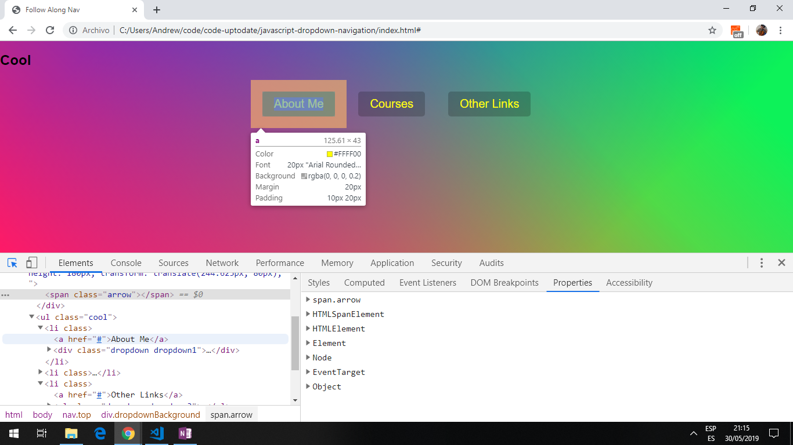

# Javascript Dropdown Navigation

A dropdown navigation menu that follows the mouse along each list item in the top. The size of the background of the dropdown adjusts to the size of the content menu. Tutorial from Wes Bos Javascript30 Youtube series.

**\* Note: to open web links in a new window use: _ctrl+click on link_**

## Table of contents

1. [General info](#general-info)
2. [Screenshots](#screenshots)
3. [Technologies](#technologies)
4. [Setup](#setup)
5. [Features](#features)
6. [Status](#status)
7. [Inspiration](#inspiration)
8. [Contact](#contact)

## General info

* Uses direct descendants, mouse events and event listeners. An ES6 function () uses this from parent function.

## Screenshots

.

## Technologies

[Javascript v1.9 ECMA-262 ECMAScript 2018](http://www.ecma-international.org/publications/standards/Ecma-262.htm)

## Setup

* Open `index.html` in browser. If any code is changed the browser needs to be refreshed.

## Code Examples

* part of function `handleEnter()` to get dropdown and nav coords and use them in const coords

```javascript
const dropdown = this.querySelector('.dropdown'); //different dropdown under each list item
const dropdownCoords = dropdown.getBoundingClientRect(); //gets dimensions of dropdown rect
const navCoords = nav.getBoundingClientRect(); //in case header added etc that would push the whole menu position down
  
const coords = {
  height: dropdownCoords.height,
  width: dropdownCoords.width,
  top: dropdownCoords.top - navCoords.top,
  left: dropdownCoords.left - navCoords.left  
};
```

## Features

* Uses the [`element.getBoundingClientRect()`](https://www.w3schools.com/jsref/met_element_getboundingclientrect.asp) method that returns the size of an element and its position relative to the viewport; properties left, top, right, bottom, x, y, width, height.

## Status & To-Do List

* Status: Working code.

* To-Do: Nothing.

## Inspiration

* [Wes Bos Youtube Javascript30 tutorial 26](https://www.youtube.com/watch?v=GvuWJSXYQDU&list=PLu8EoSxDXHP6CGK4YVJhL_VWetA865GOH&index=26)

## Contact

Repo created by [ABateman](https://www.andrewbateman.org) - feel free to contact me!
